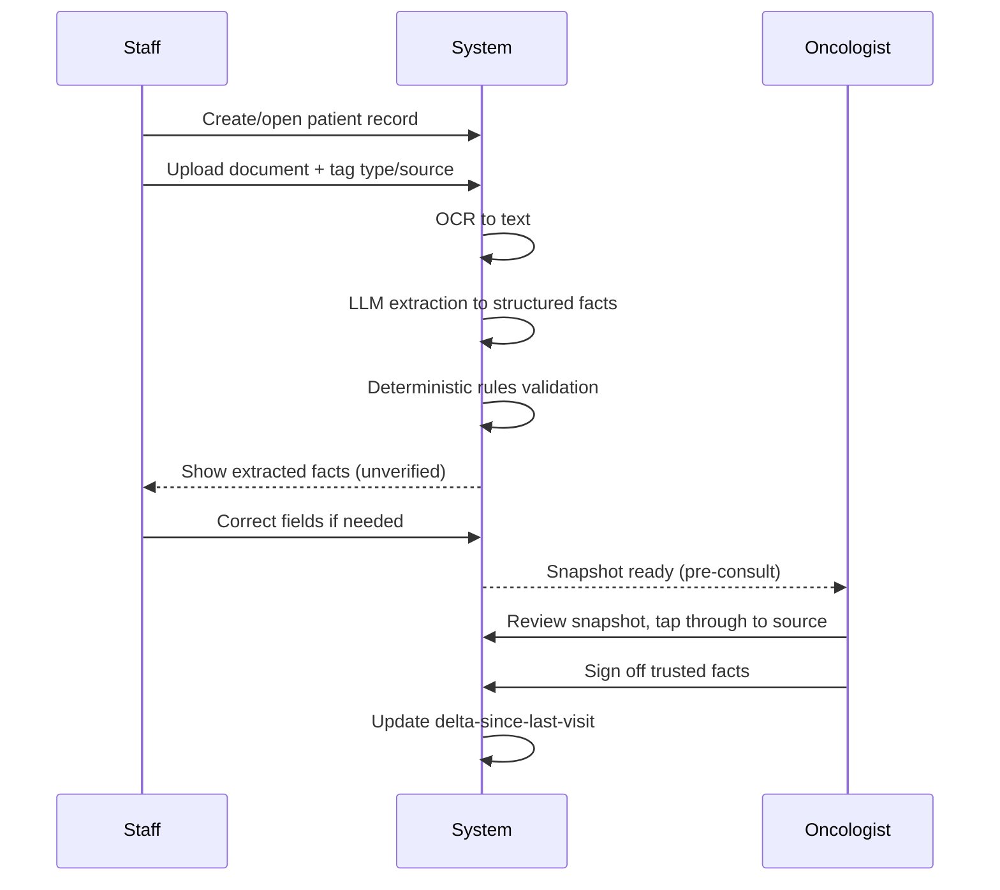
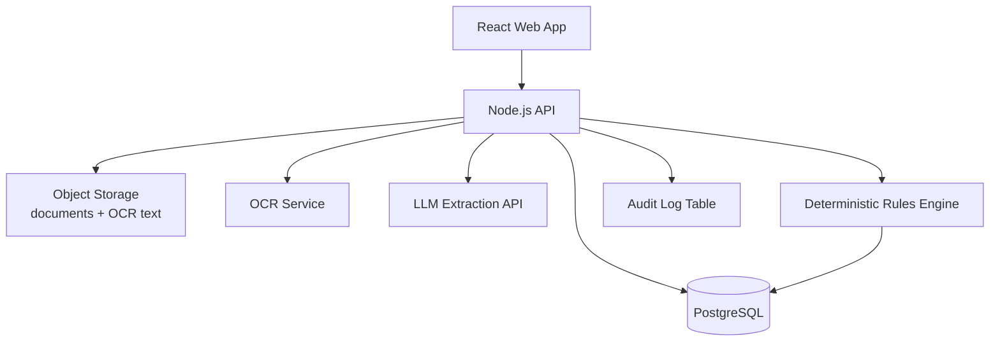
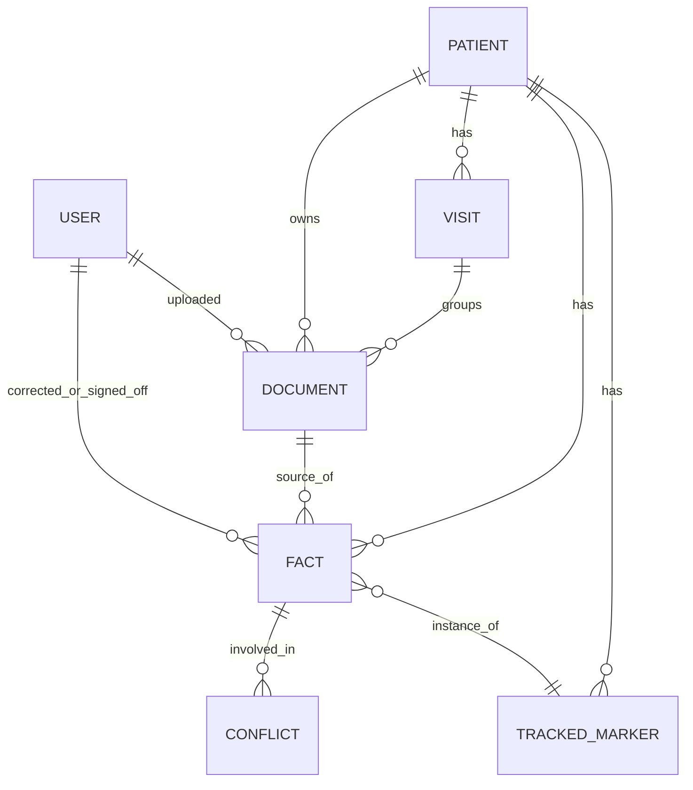
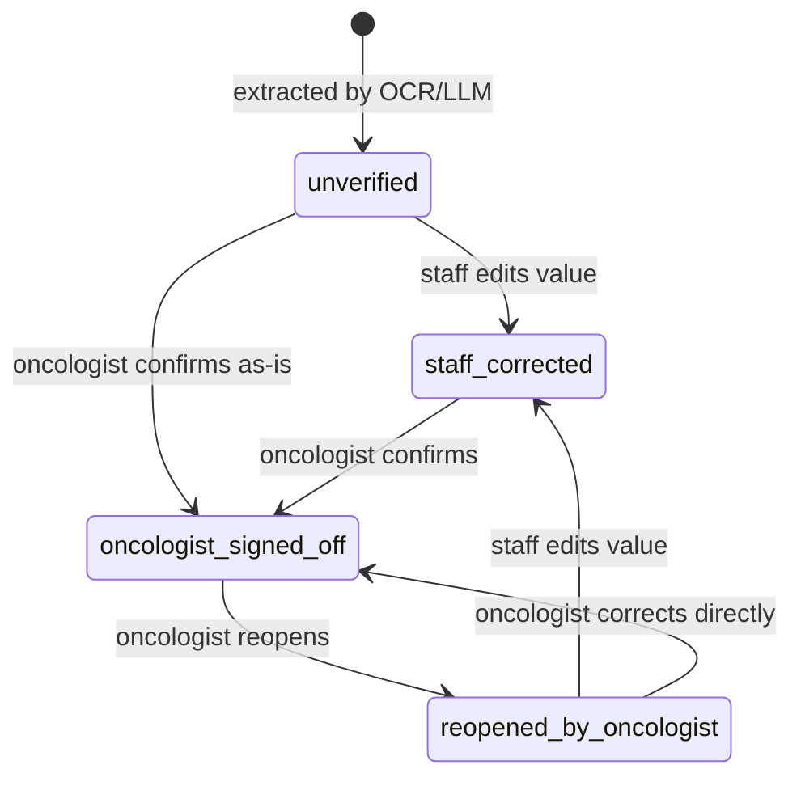
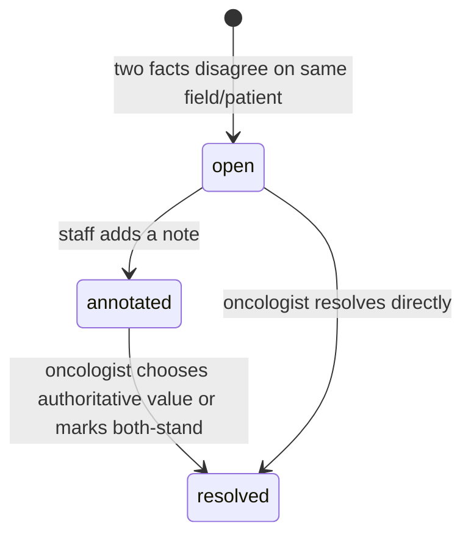

# Prelude — MVP Specification

2026-09-19 · @Someone

Implementation-ready MVP spec for a narrow AI snapshot tool that helps an oncologist prepare for OPD consultations by extracting, structuring, and trending patient data from prescriptions, blood reports, and radiology reports — sourced from the OPD project's finalized research and a closed discovery interview.

## 1. Executive Summary & Problem Statement

Build a web tool that lets a partner oncologist's clinical staff pre-load a patient's prescription, blood, and radiology reports before their OPD visit, and gives the oncologist a structured, trend-aware snapshot — markers, imaging, treatment status, and what changed since the last visit — instead of re-reading raw PDFs during a 2–10 minute consult.

**Validated problem statement.** Indian oncologists run high-volume OPDs (median 35 patients/day, 2–10 min/consult) where returning-patient prep means manually re-scanning prior prescriptions, labs, and scans — often a mix of the hospital's own digital records and a patient-carried "medical history bag" of paper, CDs, and WhatsApp PDFs from outside facilities. This costs pre-clinic and after-hours time and raises the risk of missing a changed marker or a new finding buried in a stack of documents.

**Value proposition.** The tool is an extraction-and-organization aid, not a diagnostic system: OCR + LLM extraction turns those documents into discrete, source-linked facts; deterministic rules flag out-of-range values and conflicts; the oncologist reviews and signs off before anything counts as trusted. It saves prep time and surfaces things a rushed read could miss — it never makes a clinical judgment on the oncologist's behalf.

**Product vision beyond MVP.** This is Phase 1 of a founder-owned roadmap: Phase 2 runs a structured time-motion/value validation at the partner's hospital; Phase 3, conditional on Phase 2 passing, expands to 2–3 peer NCG-affiliated centres. No venture funding is planned at any stage; the moat is workflow fit inside oncology OPDs, not extraction technology itself, which is already commoditized by incumbents like eka.care and Triomics.

## 2. Personas, Roles & Permissions

Two roles in v1: no admin/IT role, since deployment stays informal.

| Capability | Clinical Staff | Oncologist |
| --- | --- | --- |
| Create/edit patient record | Yes | Yes |
| Select tracked markers for a patient (default set + add) | Yes | Yes |
| Upload/push documents (prescription, blood, radiology) | Yes | Yes |
| Tag document type on upload (manual, v1) | Yes | Yes |
| View AI-extracted snapshot | Yes | Yes |
| Correct an AI-extracted field | Yes | Yes |
| Sign off a fact as clinically trusted | No | Yes (required before a fact is "trusted") |
| Reopen a signed-off fact for correction | No | Yes (required before staff or oncologist can edit it further) |
| View source document / provenance tap-through | Yes | Yes |
| Resolve a flagged conflict between two documents | No (can flag/annotate) | Yes |
| Delete a patient record | No | Yes |

**Sign-off is the trust gate.** An AI-extracted or staff-corrected fact is marked `unverified` until the oncologist explicitly confirms it; only signed-off facts feed the "since last visit" delta and are shown as clinically authoritative in the snapshot. Unverified facts are still visible, clearly labeled, so nothing is hidden pending review.

## 3. MVP Scope

| In scope (v1) | Out of scope (v1) | Post-MVP (Phase 2/3) |
| --- | --- | --- |
| Manual document-type tagging on upload | Automatic document-type classification | AI-based auto-routing |
| Outside-report ingestion (prescription, blood, radiology; paper/CD/WhatsApp PDF) | Ingesting other document types (pathology slides, genomics reports) | Broader document types |
| Tumor marker extraction + reference-range display | Autonomous abnormal-value *flagging* (would risk CDSCO Class C) | Reconsider after regulatory review |
| Radiology impression extraction w/ provenance tap-through | Structured RECIST measurement parsing beyond stated impression | Full RECIST tracking |
| Trend-over-visits view | Predictive/AI-generated trend interpretation | — |
| "Since last visit" delta (per-fact: new/changed/unchanged/not\_observed\_in\_current\_document\_set) | Delta vs. baseline/diagnosis (only vs. previous visit in v1) | Baseline comparison view |
| Conflict/confidence/coverage/completeness surfacing (state machine, no auto-resolution) | Automatic conflict resolution | — |
| Staff correction + oncologist sign-off workflow | Role for hospital IT/compliance | Formal hospital stakeholder onboarding |
| Controlled marker list + custom-add (no trend guarantee on customs) | Full mCODE genomics variant modeling | — |
| Cloud-hosted web app, mobile-responsive | Native mobile app | — |
| Multi-cancer-type support | Cancer-type-specific templated workflows | — |
| In-app patient consent capture | — (handled by hospital's existing process) | — |
| Time-motion validation study, multi-centre expansion | — | Phase 2, Phase 3 |
| FHIR-native store (Medplum), self-hosted inference, hash-chained audit log | — | Revisit once real compliance stakes exist |

**Riskiest assumption this MVP tests:** that a structured, source-linked snapshot meaningfully reduces the oncologist's pre-consult cognitive load and prep time — not merely that extraction is technically accurate. Extraction accuracy is necessary but not sufficient; the MVP must be evaluated on whether the oncologist actually reaches for the snapshot instead of the raw documents.

## 4. Prioritized Requirements

**Functional (P0 = blocks launch, P1 = ships if time allows, P2 = explicitly deferred)**

| ID | Requirement | Priority |
| --- | --- | --- |
| F1 | Staff can create a patient and select a default marker set at creation | P0 |
| F2 | Staff can upload a document, manually tag its type (prescription/blood/radiology) and source (own hospital/outside paper/CD/WhatsApp) | P0 |
| F3 | System OCRs + LLM-extracts structured facts from the document | P0 |
| F4 | Extracted facts run through deterministic rules validation (reference ranges, coverage\_status assignment, as-of dates) | P0 |
| F5 | Staff can view, correct, or add a marker not yet tracked for the patient | P0 |
| F6 | Oncologist can view the full snapshot: markers w/ trend, radiology impressions, treatment status, delta since last visit | P0 |
| F7 | Oncologist can sign off individual facts as clinically trusted | P0 |
| F8 | System surfaces conflicts between documents (same fact, different values) without auto-resolving | P0 |
| F9 | Every displayed fact taps through to its source document/line (provenance) | P0 |
| F10 | Oncologist can delete a patient record | P1 |
| F11 | Staff can annotate/flag a conflict for oncologist attention | P1 |
| F12 | Custom marker add (no trend-matching guarantee) | P1 |
| F13 | Auto document-type classification | P2 (deferred) |

**Nonfunctional**

| ID | Requirement |
| --- | --- |
| N1 | Web app, responsive down to tablet/mobile viewport widths |
| N2 | Cloud-hosted, accessible to the partner hospital's staff/oncologist over the internet |
| N3 | OCR pipeline must tolerate scanned/photographed paper, not just clean digital PDFs |
| N4 | Every extracted fact must carry an as-of date and a source pointer — no fact without provenance |
| N5 | No autonomous abnormal-value flagging presented as diagnostic — reference-range *display* only (regulatory positioning) |
| N6 | Reasonable performance for a single-hospital, low-concurrency deployment (tens of patients/day, not hundreds of concurrent users) — no high-availability/multi-region requirement in v1 |
| N7 | Basic uptime during clinic hours; no formal SLA in v1 given informal deployment |

## 5. User Journeys

**Journey A — Pre-clinic prep (primary flow).** Staff receive a returning patient's outside documents (or pull the hospital's own), upload and tag them, correct any low-confidence extractions, and the snapshot is ready before the oncologist sees the patient.



**Journey B — New patient onboarding.** Staff create the patient, select a default marker set from the controlled list based on cancer type, and upload the first batch of documents. No prior-visit delta exists yet — snapshot shows current values only.

**Journey C — Conflict encountered.** Two documents disagree on a fact (e.g., differing CEA values from two labs). System shows both values with dates/sources, tagged `conflict`, and never auto-resolves. Staff may annotate; only the oncologist can mark a conflict resolved (choosing which value is authoritative, or noting both stand).

**Journey D — Untracked marker appears.** A new document contains a marker not yet tracked for this patient (e.g., a newly ordered test). Staff add it via the custom-add path; it displays but without trend-matching against prior visits until it recurs under the same custom label.

**Journey E — Extraction uncertain.** OCR/LLM produces a low-confidence or ambiguous result (illegible scan, ambiguous marker name, unclear unit). The system does not invent a value or silently drop the field: the fact is created with `coverage_status = extraction_uncertain`, the raw extracted text is shown alongside the source document, and staff reviews and corrects it (or confirms it as accurate) before the oncologist can sign it off.

## 6. Screen Inventory

| Screen | Purpose | Key states |
| --- | --- | --- |
| Login | Staff/oncologist auth | Signed out, signed in, error |
| Patient list | Browse/search patients | Empty, populated, search-filtered |
| Patient creation | New patient + cancer type + default marker set | Draft, marker-selection step, saved |
| Document upload | Push a document, tag type/source | Uploading, OCR-processing, extraction-processing, ready-for-review, failed |
| Extraction review (staff) | Correct AI-extracted fields before oncologist sees them | Unverified, corrected, conflict-flagged |
| Patient snapshot (oncologist, primary screen) | Markers + trend, radiology, treatment status, delta since last visit | No-prior-visit (new patient), normal, has-conflicts, has-unverified-facts |
| Source view | Original document + highlighted source of a tapped fact | Loading, loaded, OCR-text-only fallback (if original render fails) |
| Conflict resolution (oncologist) | Choose authoritative value or mark both-stand | Open, resolved |
| Marker management (per patient) | View/add tracked markers | Default set, custom-added |

**Snapshot screen layout** (four structured blocks, per the finalized data model): Current Treatment · Tumor Markers (with trend + reference range) · Radiology (impression + provenance) · Since Last Visit (delta summary across all blocks). Every fact in every block shows, in clinician-readable language (never a raw database value): the value or state, coverage status (value found / not assessed / not found in this document set / extraction uncertain / conflicting sources), as-of date, verification state (unverified / staff-corrected / oncologist-signed-off), and a source-document link.

**Reference-range wording rule (regulatory boundary).** Allowed: show the source-provided value, unit, and reference range side by side (e.g. "142 ng/mL (ref: 0–5 ng/mL)"), or a neutral highlight when a value falls outside the stated range. Disallowed anywhere in the UI or copy: "abnormal," "flagged," "at risk," "concerning," or any phrasing implying the system made a diagnostic judgment — it displays what the source document states, nothing more. New UI copy touching markers or reference ranges must be checked against this rule before shipping.

**Current Treatment scope.** "Current Treatment" means the latest source-supported treatment regimen/status extracted from documents, each fact carrying provenance and verification state — not a modeled complete oncology treatment timeline (no computed line-of-therapy, no treatment-history reconstruction beyond what's explicitly stated in a source document).

## 7. Technology Stack

Scoped down from the research program's Phase-2/3-grade architecture (Medplum, self-hosted LiteLLM, in-India inference, hash-chained audit log) to a 2-person, Claude-Code-built v1. Revisit the heavier stack once there's a formal hospital compliance stakeholder and real deployment stakes.

| Layer | Choice | Rationale / trade-off |
| --- | --- | --- |
| Frontend | React + TypeScript, responsive CSS (no separate mobile app) | Matches team skillset, fastest path to a web+mobile-responsive UI |
| Backend | Node.js/TypeScript API | Consistent language across stack, fast to build with Claude Code |
| Database | PostgreSQL | Relational integrity for patient/fact/document relationships; JSONB columns handle the flexible marker schema without needing a document DB |
| OCR | Managed OCR API (e.g. cloud vision OCR) | Avoid building/maintaining an OCR model; must handle scanned/photographed paper, not just clean PDFs |
| LLM extraction | Hosted LLM API (prompting-only, no fine-tuning) | Matches research finding that prompting-only extraction is sufficient; avoids self-hosted inference complexity for v1 |
| File storage | Cloud object storage (e.g. S3-compatible) | Original documents + OCR text, referenced by provenance pointers |
| Auth | Simple email/password or magic-link auth, role field (staff/oncologist) | No SSO/hospital IT integration needed at this scale |
| Hosting | Single cloud VM or managed PaaS | Cloud-hosted per decision; no multi-region/HA requirement |
| Audit logging | Standard append-only application log table (not hash-chained) | Sufficient for a founder-owned informal deployment; hash-chaining deferred to Phase 2/3 when formal audit requirements apply |

**Deliberately not used in v1:** Medplum/FHIR-native store, self-hosted LLM gateway, in-India-only inference endpoints, hash-chained audit logs, mCODE-compliant data exchange formats. These remain the target end-state referenced in the research (ABDM FHIR R4, NCG-KCDO templates) but are not required to validate the core workflow hypothesis.

## 8. System Architecture



**Component responsibilities**

- **React Web App** — patient list, upload, review, snapshot, conflict-resolution, marker-management screens; role-aware UI (staff vs. oncologist).
- **Node.js API** — auth, patient/document/fact CRUD, orchestrates the extraction pipeline, enforces sign-off/permission rules.
- **PostgreSQL** — patients, documents, extracted facts (with verification state), markers, conflicts, audit entries.
- **Object Storage** — original uploaded files + raw OCR text, referenced by every fact's provenance pointer.
- **OCR Service** — converts uploaded document images/PDFs to text, attempting to capture page number and line/character location or bounding-box data where the provider supports it.
- **LLM Extraction API** — prompted (not fine-tuned) to pull structured facts from OCR text into the defined field schema, carrying forward source\_page/source\_location/source\_snippet from the OCR step onto each FACT. These fields are left null, never fabricated, when a reliable location can't be determined — provenance then falls back to the document/page level, with that limitation shown, not hidden.
- **Deterministic Rules Engine** — reference-range checks, the five-state coverage\_status model (value\_found/not\_assessed/not\_found\_in\_document\_set/extraction\_uncertain/conflicting\_sources), as-of date enforcement, conflict detection between facts for the same patient/field/date-window — runs in application code, not the LLM.
- **Audit Log Table** — append-only record of who uploaded/corrected/signed off/reopened what and when, including which actor reopened a signed-off fact.

**Data flow (single upload):** document in → OCR text → LLM extraction → rules validation (range check, conflict check against existing facts) → stored as `unverified` facts → staff correction (optional) → oncologist sign-off → fact becomes `trusted` and feeds the snapshot's delta view.

## 9. Data Model



**PATIENT** — `id`, `name` (or MRN reference), `cancer_type` (free-text/coded, multi-type supported), `created_at`, `created_by`.

**VISIT** — `id`, `patient_id`, `visit_date`. A lightweight grouping of the documents pushed for one OPD consult (not a full encounter-management model) — every `DOCUMENT` belongs to exactly one `VISIT`, and delta computation compares the current visit's document set against the previous relevant visit's, not individual facts by timestamp.

**TRACKED\_MARKER** — `id`, `patient_id`, `marker_name` (from controlled list or custom), `is_custom` (bool), `added_at`, `added_by`. Custom markers are flagged so the UI can withhold trend-matching guarantees.

**DOCUMENT** — `id`, `patient_id`, `visit_id`, `file_ref` (object storage pointer), `document_type` (prescription/blood/radiology — manually tagged), `source_origin` (own-hospital/outside-paper/outside-CD/whatsapp-pdf), `uploaded_by`, `uploaded_at`, `ocr_status` (pending/done/failed), `ocr_text_ref`.

**FACT** — `id`, `patient_id`, `visit_id`, `document_id` (provenance), `tracked_marker_id` (nullable — null for non-marker facts like treatment regimen or radiology impression), `field_type` (marker\_value / reference\_range / treatment\_regimen / radiology\_impression / disease\_status\_trend), `value`, `unit`, `reference_range` (nullable), `as_of_date`, `coverage_status` (value\_found / not\_assessed / not\_found\_in\_document\_set / extraction\_uncertain / conflicting\_sources — see §10a Failure Taxonomy; absence from the uploaded document set is never treated as proof a test/value doesn't clinically exist), `verification_state` (unverified/staff\_corrected/oncologist\_signed\_off), `delta_status` (new/changed/unchanged/not\_observed\_in\_current\_document\_set, computed vs. the previous relevant visit's document set), `source_page`, `source_location` (OCR line/character range or bounding box, where available), `source_snippet` (extracted text supporting the value, where useful), `corrected_by` (nullable), `signed_off_by` (nullable), `signed_off_at` (nullable).

**CONFLICT** — `id`, `fact_id_a`, `fact_id_b` (same patient/field/overlapping date, differing values), `status` (open/annotated/resolved), `resolution_note` (nullable), `resolved_by` (nullable), `resolved_at` (nullable).

**USER** — `id`, `name`, `role` (staff/oncologist), `email`, `created_at`.

**Validation rules:** every `FACT` requires a non-null `as_of_date` and `document_id`; `coverage_status` defaults to `not_assessed` until a value is extracted; a `FACT` cannot be `oncologist_signed_off` without a `USER.role = oncologist` actor; a `CONFLICT` can only move to `resolved` via an oncologist action.

**Retention/migration:** no formal retention policy required in v1 (informal deployment, consent handled outside the system) — flagged as an open item before any Phase 2 formalization. No migration needs; this is a greenfield build with no existing HMS/EMR to migrate from.

## 10. Business Rules & State Machines

**Fact verification state**



Only `oncologist_signed_off` facts count toward the trusted delta view; `unverified` and `staff_corrected` facts are visible but visually distinguished as not-yet-trusted. A signed-off fact cannot be edited or reopened by staff directly — only an oncologist can reopen it (reopened\_by\_oncologist), after which staff may correct it or the oncologist may correct it directly; both paths return to oncologist\_signed\_off. The LLM never transitions a fact into oncologist\_signed\_off or any other trusted state.

**Conflict state**



**Conflict detection rule (patient-wide, not visit-scoped):** two `FACT` rows for the same `patient_id` + `field_type` (+ `tracked_marker_id` where applicable) with overlapping or ambiguous `as_of_date` and differing `value` → auto-create a `CONFLICT` in `open` state, regardless of whether they came from the same visit or different visits. This includes multiple documents within one visit that report different values for the same field. Same value + compatible dates across documents/visits are retained as separate source facts, not merged, and never create a conflict. The system never uses last-write-wins — no fact is silently overwritten. Detection is deterministic (a rules-engine comparison), not LLM judgment; only the oncologist resolves a conflict.

**Delta computation rule:** delta is computed per visit/document-batch, not per arbitrary fact timestamp. For each `FACT` in the current visit's document set, compare `value`/`coverage_status` against the most recent prior `oncologist_signed_off` fact of the same `field_type`/`tracked_marker_id` from the previous relevant visit's document set for that patient. Result: `new` (no prior signed-off fact exists), `changed` (value differs), `unchanged` (value matches), `not_observed_in_current_document_set` (a previously tracked field has no corresponding fact in the current visit's documents — a coverage gap, never presented as a claim the value is clinically absent).

**Custom marker delta behavior.** "No trend-matching guarantee" (§3, §9) means the system never attempts automatic semantic matching between *differently named* custom markers — it does not mean custom markers are excluded from delta computation. The same `tracked_marker_id` recurring across visits (controlled or custom) gets normal delta computation: a newly added custom marker is `new`; an existing custom marker recurring in a later visit is `changed` or `unchanged` under the same deterministic rule as any other field.

**Edge cases:**

| Case | Handling |
| --- | --- |
| Document uploaded with no extractable text (blank/corrupted scan) | `ocr_status = failed`; staff notified, manual re-upload required |
| Marker value present but no reference range in source document | `coverage_status = value_found`, `reference_range = null`; UI shows value without abnormal/normal framing |
| Amended/corrected report supersedes an earlier one | Treated as a new `DOCUMENT` → new `FACT`s; triggers conflict detection against the original if values differ, not silent overwrite |
| Patient has zero prior visits | Snapshot shows current values only; all facts `delta_status = new`; no delta section rendered as "since last visit" |
| Staff uploads a document type that doesn't match what they tag | No system-level validation in v1 (manual tagging is trusted input) — oncologist review is the catch |

## 10a. Failure Taxonomy

The snapshot distinguishes five coverage states for any tracked field: **value found**, **not assessed** (not ordered/tested), **not found in the uploaded document set** (a coverage gap, not evidence of clinical absence), **extraction uncertain** (low-confidence or ambiguous OCR/LLM result), and **conflicting sources** (documents disagree). Absence from the uploaded documents is never presented as proof a test or value doesn't exist.

**Coverage-status transition rules (deterministic, no separate state-machine UI needed).**

Initial extraction:

- No usable evidence/value → `not_assessed`
- Value successfully extracted → `value_found`
- Source explicitly indicates the test/result was not performed → `not_applicable` (or the appropriate non-value state)
- Extraction cannot reliably determine the value → `extraction_uncertain`
- Conflicting observations detected → `conflicting_sources`

Correction/review:

- `extraction_uncertain` → `value_found` when staff/oncologist supplies a verified value
- `extraction_uncertain` → `not_assessed` when review confirms no usable value exists
- `conflicting_sources` stays linked to its open `CONFLICT` until the oncologist resolves it (§10)

`coverage_status` and `verification_state` are independent: coverage describes what evidence was found; verification describes whether a clinician has trusted the fact. The LLM never sets `verification_state` to `oncologist_signed_off` — only an oncologist action does, regardless of `coverage_status`.

| Failure type | MVP state/UI behavior | How it's tested |
| --- | --- | --- |
| Extraction failure (OCR/LLM produces no value) | `coverage_status = extraction_uncertain` or `ocr_status = failed`; never silently invented or discarded, shown as needing staff input | Feed documents with known unreadable sections; verify no value is fabricated and the gap is visibly flagged |
| Source ambiguity (unclear which document/section) | Fact withheld from auto-creation until a resolvable source pointer exists; staff prompted to confirm manually | Feed a multi-document upload with an ambiguous value; verify the system doesn't guess a source |
| Temporal/date ambiguity | `as_of_date` required on every fact; a document with no extractable date blocks auto-creation, routes to manual date entry | Feed a document with no visible date; verify no guessed date is created |
| Marker/entity/unit ambiguity | Routed to the controlled marker list match; no confident match → held as `extraction_uncertain` with the raw label shown for staff to map or custom-add | Feed a document using a marker synonym or non-standard unit; verify it isn't silently mismapped |
| Provenance failure (value found, source unpinpointable) | `source_location`/`source_snippet` left null rather than fabricated; UI shows "source detail unavailable" instead of a broken/fake link | Feed a document type where line-level OCR fails; verify the UI degrades honestly |
| Completeness/coverage failure (field absent from the document set) | `coverage_status = not_found_in_document_set` — never conflated with `not_assessed` or treated as clinical absence | Upload a set missing an expected marker; verify the snapshot shows a coverage gap, not a false negative |
| Conflict between sources | Deterministic `CONFLICT` creation (§10); no auto-resolution | Feed two documents with differing values for the same field/date window; verify a conflict is created, not silently overwritten |
| Workflow/presentation failure (correct data, misleading display) | Reference-range wording checked against the display-not-flagging boundary (§6, §12); no derived clinical claims added by the UI layer | Manual UI copy review against the wording rule before each release |
| Trust/verification failure (unverified fact treated as trusted) | Only `oncologist_signed_off` facts feed the delta view and are shown as clinically authoritative | Attempt to trigger delta computation from an `unverified` fact; verify it's excluded |

## 11. API Contracts

| Method & Path | Purpose | Role |
| --- | --- | --- |
| `POST /patients` | Create patient + initial marker set | Staff, Oncologist |
| POST /patients/:id/visits | Create/open the current visit/document batch | Staff, Oncologist |
| `GET /patients/:id/snapshot` | Fetch full snapshot (markers, treatment, radiology, delta) | Staff, Oncologist |
| `POST /patients/:id/markers` | Add a tracked marker (controlled or custom) | Staff, Oncologist |
| `POST /patients/:id/documents` | Upload a document + type/source tag (requires visit\_id; a document must belong to exactly one visit) | Staff, Oncologist |
| `GET /documents/:id` | Fetch document + OCR text + source render | Staff, Oncologist |
| `PATCH /facts/:id` | Correct an extracted fact's value (403 if the fact is oncologist\_signed\_off and not yet reopened) | Staff, Oncologist |
| `POST /facts/:id/sign-off` | Oncologist signs off a fact as trusted | Oncologist only |
| POST /facts/:id/reopen | Reopen an oncologist\_signed\_off fact (required before it can be corrected) | Oncologist only |
| `POST /conflicts/:id/resolve` | Resolve a conflict (choose value / mark both-stand) | Oncologist only |
| `POST /conflicts/:id/annotate` | Add a note to an open conflict | Staff, Oncologist |
| `DELETE /patients/:id` | Delete patient record | Oncologist only |

**Example — `POST /facts/:id/sign-off`**

```json
// Request
{ "signed_off_by": "user_123" }

// Response 200
{
  "id": "fact_456",
  "verification_state": "oncologist_signed_off",
  "signed_off_by": "user_123",
  "signed_off_at": "2026-09-19T10:15:00Z"
}

// Response 403 (actor is not role=oncologist)
{ "error": "forbidden", "message": "Only an oncologist can sign off a fact." }
```

**Error handling conventions:** `400` malformed input, `403` role/permission violation (e.g., staff attempting sign-off or delete), `404` unknown patient/document/fact id, `409` conflict-state violation (e.g., resolving an already-resolved conflict), `422` OCR/extraction failure on a document (`ocr_status: failed` returned in body, not a hard error — upload itself still succeeds). All error responses: `{ "error": "<code>", "message": "<human-readable>" }`.

## 12. Security, Privacy & Audit

**Authentication:** email/password or magic-link, session-based; two roles (`staff`, `oncologist`) enforced at the API layer on every write endpoint.

**Authorization:** role checks per endpoint per the API table in §11 — sign-off, conflict resolution, and patient deletion are oncologist-only; all other actions available to both roles.

**Privacy/consent:** patient consent for data capture and use is handled entirely outside this system, by the hospital's existing process — **explicitly out of MVP scope.** This is a real gap to flag: the system stores identifiable patient data with no in-app consent trail. Acceptable for an informal, single-hospital v1 with the hospital's own process covering it; must be revisited before any Phase 2/3 expansion beyond the founding partner.

**Data protection posture:** DPDP Rules 2025 apply to Indian patient health data; foreign LLM API use is permissible under DPDP's negative-list cross-border model provided a Data Processing Agreement is in place with the LLM vendor — **confirming a DPA exists with the chosen LLM provider is a pre-launch action item**, not yet done.

**Audit logging:** append-only log table records every create/correct/sign-off/resolve/delete action with actor, timestamp, and before/after values for corrections. Not hash-chained in v1 (deferred — see §7); sufficient to answer "who changed what, when" but not tamper-evident to a forensic standard.

**Backup/recovery:** standard managed-database automated backups (daily snapshot, point-in-time recovery if the hosting provider supports it) — no custom DR plan needed at this scale. Document storage (object store) typically has built-in redundancy from the provider.

**Explicitly deferred to Phase 2/3:** formal DPDP compliance audit, hash-chained tamper-evident logs, in-app consent capture, CDSCO regulatory filing (current posture only targets staying *outside* CDSCO's device classification via careful feature scoping — not formal submission).

## 13. Integrations & External Dependencies

| Dependency | Role | Notes |
| --- | --- | --- |
| Hosted LLM API | Fact extraction from OCR text | Requires a Data Processing Agreement (DPDP compliance) — pre-launch action item |
| OCR service | Document-to-text conversion | Must handle scanned/photographed paper reliably; evaluate 2–3 vendors against real sample documents before committing |
| Cloud hosting provider | App + database + object storage hosting | No existing HMS/EMR integration required — fully standalone |
| Email/auth provider (if magic-link) | User authentication | Lightweight; no SSO needed |

**No integrations required with:** hospital HMS/EMR (none exists), ABDM/FHIR systems (target standard, not a live integration in v1), NCG-KCDO reporting systems (referenced as a data-model target, not a live feed). These stay aspirational standards to *design toward* in field naming, not live integrations to build against in v1.

## 14. Repository, Environments & Deployment

**Repo structure**

```
/opd-snapshot
  /apps
    /web        (React frontend)
    /api        (Node.js backend)
  /packages
    /shared      (shared types: Patient, Document, Fact, Conflict)
  /infra         (deployment config)
  /docs
```

**Environments:** `local` (dev, seeded data), `staging` (pre-release, for the 2-person team to test against realistic sample documents), `production` (live with the partner oncologist). No separate QA environment needed at this scale — staging serves that role.

**Configuration:** environment variables for LLM API key, OCR service key, database connection string, object storage credentials — never committed; `.env.example` checked in, real `.env` per environment.

**Deployment:** cloud-hosted (per decision), simple CI — push to main deploys to staging, manual promote to production. No blue/green or canary needed at this scale.

**Observability:** application logs (structured, e.g. JSON) covering API requests, OCR/extraction pipeline success/failure per document, and errors. No dedicated APM/tracing tooling required for v1 — log volume and team size don't justify it yet; revisit if extraction failures become hard to diagnose from logs alone.

## 15. Testing Plan & Acceptance Criteria

| Feature | Acceptance criteria |
| --- | --- |
| Document upload + tagging | Staff can upload a PDF/image, select type and source, and see it appear in the patient's document list within a reasonable time |
| OCR + extraction | For a clean digital PDF, correctly extracted marker values match source ≥90% of fields on a test set of ≥20 sample documents; for scanned/photographed paper, extraction attempts run without crashing and flag low-confidence fields for review |
| Reference-range display | A marker value outside its stated reference range is visually distinguished, without any autonomous "abnormal" clinical claim in the copy |
| Delta view | Given two visits' signed-off facts for the same field, the system correctly labels the second as new/changed/unchanged/not\_observed\_in\_current\_document\_set |
| Conflict detection | Two facts with differing values for the same patient/field/overlapping date auto-create an `open` conflict; the UI surfaces it without auto-resolving |
| Sign-off | A staff account cannot call sign-off (403); an oncologist account can, and the fact's state updates immediately in the snapshot |
| Provenance | Every displayed fact links to its source document at the correct location |

**Severity classification (aggregate accuracy alone doesn't gate release).** The ≥90% field-match rate above is an engineering baseline, not the release bar on its own. Extraction errors are additionally classified by severity: **critical** (wrong treatment regimen, wrong marker value, wrong date, or broken/incorrect provenance link), **moderate** (wrong unit, mismatched marker name), **minor** (formatting/whitespace differences). No release proceeds with a known critical-severity error rate above a low, explicitly agreed threshold, regardless of the aggregate score.

**Testing strategy:** manual QA by the 2-person team against a de-identified test document set (reuse or extend the earlier 10-patient set if still available) before the partner oncologist touches it; no automated end-to-end test suite required for v1 given team size, but unit tests around the rules engine (conflict detection, delta computation, reference-range logic) are worth the investment since that logic is deterministic and easy to regress silently.

**Pilot plan:** informal use by the partner oncologist and their staff on real (consented, per hospital's own process) returning patients. Success is still primarily the oncologist's subjective feedback (per decision log — this stays observational, not a formal Phase-2 time-motion study), supplemented with lightweight measures tracked during the pilot:

- snapshot-used vs. reverted-to-raw-documents, per consult
- prep time/burden, where practical to note informally (not instrumented)
- correction rate (staff corrections ÷ total extracted facts)
- conflicts encountered
- important information the oncologist says was missed
- unnecessary/noisy information the oncologist says got in the way
- cases requiring fallback to raw documents, and why

**Definition of done (per feature):** acceptance criteria above met, reviewed by the other builder, and demonstrable end-to-end on at least one real or realistic patient record without manual database intervention.

## 16. Seed Data & Demo Scenario

**Seed data needed:** 2–3 synthetic patients spanning different cancer types, each with 2+ visits so the delta view has something to compute against — include at least one patient with a deliberate marker conflict (two documents, differing values) and one with a not_observed_in_current_document_set field, to exercise the state machine paths during development without waiting on real documents.

**Demo scenario (for showing the oncologist or any stakeholder):**

1. Open patient list → select a returning patient.
2. View their pre-populated snapshot: markers with trend, current treatment, radiology impression, delta-since-last-visit clearly marked.
3. Tap a marker value → jump to source document, see it highlighted.
4. Show the conflict case: two documents disagree → conflict badge visible → walk through resolution as the oncologist.
5. Upload a new document live → watch it move from `unverified` → staff correction → oncologist sign-off → reflected in the snapshot.

This sequence doubles as the core acceptance walkthrough and the pitch to any future stakeholder (peer oncologist, Phase 3 discussion) — it's worth keeping the seed data clean enough to demo without caveats.

## 17. Phased Implementation Plan

Build order follows the research roadmap's Feature 6 → 5 → 3 sequencing, adapted to this MVP's full 5-feature scope (document-type tagging is manual, so it's not a separate build step — it's a field on the upload form).

| Milestone | Scope | Depends on |
| --- | --- | --- |
| M1 — Foundation | Data model, auth, patient CRUD, document upload + manual tagging + storage | — |
| M2 — Ingestion (Feature 6) | OCR pipeline, LLM extraction, facts stored as `unverified` | M1 |
| M3 — Review & sign-off | Staff correction UI, oncologist sign-off flow, role enforcement | M2 |
| M4 — Delta view (Feature 5) | Delta computation rule, "since last visit" snapshot section | M3 (needs ≥2 visits of signed-off facts) |
| M5 — Markers & reference ranges (Feature 3, rescoped) | Controlled marker list, custom-add, reference-range display | M2 |
| M6 — Radiology & trends (Features 2, 4) | Radiology impression extraction + provenance, trend-over-visits chart | M2, M4 |
| M7 — Conflict handling | Conflict detection rule, conflict UI, resolution flow | M2, M3 |
| M8 — Pilot readiness | Seed/demo data, manual QA pass, deploy to production, DPA confirmed | M1–M7 |

M1–M3 form the critical path (nothing else works without ingestion + review); M4–M7 can parallelize across the 2-person team once M3 is stable.

## 18. Risks, Assumptions & Mitigations

| Risk/Assumption | Type | Mitigation |
| --- | --- | --- |
| Tech stack scoped to Postgres + hosted LLM API, skipping Medplum/FHIR/self-hosted inference | Assumed (Claude's call, not objected to) | Revisit before Phase 2/3 when formal compliance stakes exist |
| No DPA confirmed yet with chosen LLM vendor | Open action item | Must close before production launch with real patient data |
| No in-app consent capture; relies entirely on hospital's outside process | Accepted risk for v1 | Revisit if expanding beyond the founding partner hospital |
| OCR reliability on scanned/photographed paper is unproven for this specific pipeline | Risk | Test against real sample outside-reports early (M2), before committing to a single OCR vendor |
| LLM extraction hallucination risk, evaluated against our own document test set (§15) rather than a generic published rate | Known risk, mitigated by design | Mandatory human review/sign-off before any fact is trusted; tool positioned as extraction aid, not autonomous summarizer |
| Success criteria is primarily subjective (oncologist feedback), supplemented by the lightweight pilot measures in §15 | Accepted for v1 | Lightweight pilot measures catch gaps early; Phase 2 is where a structured time-motion study with hard go/no-go gates happens |
| Custom markers have no trend-matching guarantee — may frustrate staff if used often | Risk | Monitor custom-add usage during pilot; promote frequently-used customs to the controlled list |
| Single-site, single-partner dependency (one oncologist, one hospital) | Known limitation, explicitly accepted (mirrors the pilot methodology's single-rater constraint) | Phase 3 expansion is the mitigation, conditional on Phase 2 passing |
| Regulatory positioning (avoiding CDSCO Class C) depends on staying strictly within reference-range *display*, never *flagging* language | Risk if scope creeps | Explicit review of any new feature against this boundary before building it |

## 19. MVP Readiness Checklist

- [ ] M1–M8 milestones (§17) complete and demoed end-to-end
- [ ] All P0 functional requirements (§4) meet their acceptance criteria (§15)
- [ ] DPA in place with the LLM vendor
- [ ] OCR tested against real (or realistic) scanned/paper outside-reports, not just clean PDFs
- [ ] Sign-off, conflict-resolution, and delete actions correctly restricted to oncologist role
- [ ] Every fact in the UI shows as-of date, verification state, and a working provenance link
- [ ] Seed/demo data set ready and walkthrough (§16) rehearsed
- [ ] Reference-range display copy reviewed against the "display, not flagging" regulatory boundary
- [ ] Partner oncologist and staff briefed on the workflow (upload → correct → sign-off) before first real use
- [ ] Patient consent confirmed as covered by the hospital's existing process before any real patient data enters the system

**Definition of done for v1:** the partner oncologist can, for a real returning patient, open the snapshot instead of the raw document stack, review and sign off the facts they trust, and give subjective feedback on whether it saved them time or reduced missed details — without the team needing to touch the database directly to make any of that happen.

## Decision Delta from Previous OPD Specification

- Added §10a Failure Taxonomy (9 failure types → MVP state/UI behavior → test method)
- Replaced the tri-state `assessed_status` with a five-state `coverage_status` (value found / not assessed / not found in document set / extraction uncertain / conflicting sources) on `FACT`
- Renamed `delta_status`'s `newly_missing` to `not_observed_in_current_document_set`; absence from the document set is never treated as clinical absence
- Added a lightweight `VISIT` entity; delta computation now compares document sets per visit, not individual facts by timestamp
- Strengthened provenance on `FACT`: added `source_page`, `source_location`, `source_snippet`
- Added Journey E (extraction-uncertain workflow) to §5
- Added an explicit reference-range wording rule (allowed/disallowed language) and a Current Treatment scope clarification to §6
- Added severity classification (critical/moderate/minor) to extraction acceptance testing in §15
- Expanded the pilot plan (§15) with lightweight usage/correction/conflict/missed-info measures, still explicitly not a formal Phase-2 study
- Removed the generic "1.5–23% hallucination rate" claim from §18; replaced with evaluation against our own document test set
- All other MVP decisions (§12 of the prior spec) preserved unchanged
- - Fixed six stale references to the retired `assessed_status`/`newly_missing` terms in §3, §4, §8, §9, §10, §15, §16 (audit findings A1–A6 plus one additional stale `tri-state` reference in §4 F4 found during the final sweep)
  - Added `POST /patients/:id/visits` to §11 and required `visit_id` on the document-upload endpoint
  - Locked conflict detection as patient-wide (not visit-scoped): same-visit documents with differing values now explicitly create a conflict; same-value duplicates never do; no last-write-wins
  - Locked custom-marker delta behavior: same `tracked_marker_id` recurring across visits gets normal delta computation; only cross-name semantic matching stays unsupported
  - Locked signed-off correction permissions: added `reopened_by_oncologist` to the fact state machine, a Personas row, a `POST /facts/:id/reopen` endpoint (oncologist only), and audit-log coverage — staff can no longer edit or reopen a signed-off fact directly
  - Added explicit deterministic `coverage_status` transition rules to §10a; confirmed `coverage_status` and `verification_state` are independent, and the LLM never sets a fact to `oncologist_signed_off`
  - Updated §6 snapshot display to explicitly list `coverage_status` as a clinician-readable field on every displayed fact
  - Updated §8 OCR/LLM pipeline description to state it attempts to populate `source_page`/`source_location`/`source_snippet`, nullable and never fabricated, with a stated document/page-level fallback
  - Added an explicit same-visit duplicate-observation rule: same value + compatible dates → retain both facts, no conflict; differing values → conflict, oncologist resolves

**MVP Specification v1.1 is frozen for implementation.**
